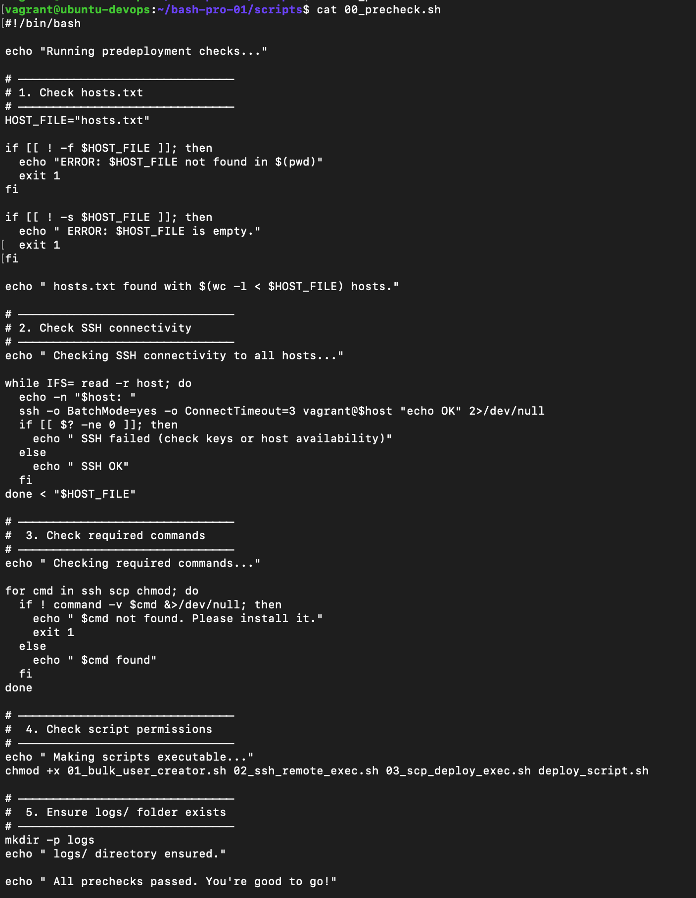
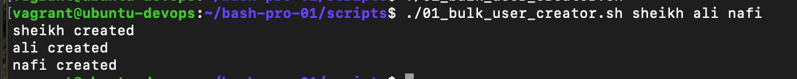

# FameTech DevOps Lab – Bash User & Remote Job Automation Toolkit

> In this hands-on DevOps lab, I designed a reusable Bash automation toolkit to streamline onboarding across Dev/Test environments.  
> The toolkit supports bulk user creation, SSH-based remote execution, and SCP-based script deployment to simulate multi-host provisioning in a real DevOps environment.

---

## About This Project

This repository demonstrates my hands-on DevOps engineering experience during my project-based role at **FameTech**, a New York-based technology agency.

As a **DevOps Engineer** on the Infrastructure Automation Team, I was responsible for automating initial user and configuration setup across multiple QA/staging VMs.  
This lab was structured in a sprint-based format, focusing on CLI-driven infrastructure automation using only Bash, SSH, and native system tools.

> This project experience is verifiable by FameTech upon request.

---

## Lab Metadata

| Field      | Detail                               |
| ---------- | ------------------------------------ |
| Lab ID     | BASH-PRO-001                         |
| Engineer   | Sheikh Ahmed (DevOps Engineer)       |
| Company    | FameTech NYC                         |
| Sprint     | Sprint 2 – Access Automation Toolkit |
| Platform   | Ubuntu, CentOS, Vagrant, Bash        |
| Difficulty | Intermediate to Advanced             |
| Time       | ~60–90 minutes                       |

---

## Objectives

- Automate bulk Linux user creation with flexible CLI arguments
- Remotely run commands via SSH using looped host inventory
- Deploy and execute scripts on multiple VMs via SCP
- Capture logs and ensure idempotent, error-tolerant behavior
- Simulate real-world DevOps onboarding of staging servers

---

## Tools & Concepts Used

| Tool / Concept       | Purpose                                               |
| -------------------- | ----------------------------------------------------- |
| `bash` scripting     | Automate user creation and remote deployment          |
| `ssh`, `scp`         | Securely connect and transfer scripts to remote hosts |
| `useradd`, `id`      | Manage user accounts programmatically                 |
| CLI arguments (`$@`) | Accept dynamic input for reusable automation          |
| Host inventory file  | Loop through multiple VMs for mass deployment         |
| Logging              | Capture results to `/var/log/user_manager.log`        |

---

## Predeployment Requirements

Before using these scripts, make sure:

- [ ] All remote hosts are running and reachable
- [ ] SSH access is passwordless (use `vagrant ssh-config` or SSH keys)
- [ ] You’ve created and populated `hosts.txt` with all target VM names or IPs
- [ ] The current user can run `scp`, `ssh`, and `useradd` (with `sudo` if needed)
- [ ] All `.sh` scripts are executable: `chmod +x *.sh`

---

## Scenario – Ticket-Based Simulation

**Ticket**: `FAME-BASH-001`  
**Reported By**: Senior DevOps Engineer  
**Assigned To**: Sheikh Ahmed  
**Priority**: High  
**Status**: Completed

I was assigned to develop a Bash-based onboarding toolkit to quickly prepare multiple QA VMs with required users, config files, and health-check logic.  
The deliverable had to be portable, headless, and capable of running from a single control node using SSH and SCP.

---

## Implementation

### Step 1 – Bulk User Creation (`01_bulk_user_creator.sh`)

```bash
#!/bin/bash
for user in "$@"; do
  id "$user" &>/dev/null || sudo useradd "$user"
  echo "$user created"
done
```

- [ ] Accepts multiple usernames from CLI and creates them only if they don’t already exist.

---

### Step 2 – Remote Health Checks (`02_ssh_remote_exec.sh`)

```bash
for host in $(cat hosts.txt); do
  ssh "$USER@$host" "uptime; df -h"
done
```

- [ ] Loops through `hosts.txt` and performs basic availability checks.

---

### Step 3 – SCP-Based Script Deployment (`03_scp_deploy_exec.sh`)

```bash
scp deploy_script.sh user@host:/tmp/
ssh user@host "bash /tmp/deploy_script.sh && rm /tmp/deploy_script.sh"
```

- [ ] Pushes and runs a provisioning script remotely, then removes it for cleanup.

---

### Step 4 – Precheck Validator (`00_precheck.sh`)

```bash
- Validates presence and content of hosts.txt
- Verifies SSH access to each host
- Ensures required tools (ssh, scp) are installed
- Makes all scripts executable
- Creates logs/ folder for output tracking
```

Run before any deployment to ensure all prerequisites are met.

---

## Folder Structure

```
bash-pro-lab-001/
├── 00_precheck.sh              # ✅ Pre-deployment validator
├── 01_bulk_user_creator.sh     # ✅ User creation logic
├── 02_ssh_remote_exec.sh       # ✅ Health check via SSH
├── 03_scp_deploy_exec.sh       # ✅ Deploy script via SCP
├── deploy_script.sh            # ✅ The actual provisioning script
├── hosts.txt                   # ✅ VM inventory
├── logs/                       # ✅ Execution output
├── screenshots/                # ✅ Evidence of completion
└── README.md                   # ✅ This file
```

---

## Screenshots

All screenshots related to this lab are stored in the `/screenshots/` folder:

- precheck configuration
  
- Bulk user creation
  

---

## Validation Checklist

| Item                                          | Status |
| --------------------------------------------- | ------ |
| hosts.txt populated and valid                 | ✅     |
| All scripts marked executable                 | ✅     |
| SSH works without prompt                      | ✅     |
| Users created via `useradd` remotely          | ✅     |
| Script deployed via SCP and executed remotely | ✅     |
| Logs written per host                         | ✅     |

---

## Interview Q\&A

> **Q**: Why use `$@` in Bash instead of hardcoding users?  
> **A**: `$@` makes the script reusable. You can pass usernames dynamically from the CLI.

> **Q**: How do you run a script remotely using Bash?  
> **A**: Use `scp` to copy it to the server and `ssh` to execute it:
> `scp script.sh user@host:/tmp/ && ssh user@host "bash /tmp/script.sh"`

> **Q**: Why remove the script after execution?  
> **A**: To keep `/tmp/` clean, avoid re-runs, and simulate production cleanup best practices.

> **Q**: What if SSH prompts for password in automation?  
> **A**: Automation should use passwordless SSH via key pairs or `vagrant ssh-config`.

---

## Real-World Use Cases

| Scenario                             | Relevance                                              |
| ------------------------------------ | ------------------------------------------------------ |
| QA environment onboarding            | Spin up 10+ VMs with uniform user/config setup         |
| Cloud bootstrap (headless setup)     | Automate server provisioning via control machine       |
| DevOps testbed for CI/CD preparation | Ensure all environments have consistent starting state |
| Log-driven automation validation     | Prove actions completed per-host with traceable output |

---

## Common Mistakes & Fixes

| Mistake                                 | Fix                                                         |
| --------------------------------------- | ----------------------------------------------------------- |
| Script not executable                   | Use `chmod +x script.sh` before deploying                   |
| SSH asks for password                   | Use SSH key-based access or Vagrant’s identity file         |
| `hosts.txt` includes blank lines or `#` | Strip blank/comment lines or use a line filter in your loop |
| Script fails on rerun                   | Use `id "$user"` check to make logic idempotent             |

---

## Security & Production Notes

- Avoid hardcoded usernames or IPs — use `hosts.txt` for flexibility
- Use `sudo` responsibly and secure scripts with permissions
- Redirect logs to `/var/log` or central monitoring in production setups
- Secure `scp` with fingerprint validation in non-lab environments

---

## FameTech Story

As part of **Sprint 2**, I was tasked with developing a robust Bash toolkit for automated onboarding of QA/staging VMs.
The scripts were built to support dynamic input, multi-host looping, remote execution, and cleanup — reflecting the same practices used in real-world DevOps workflows.

This project was executed entirely in CLI using Bash, SSH, and Vagrant-managed virtual machines, preparing the ground for future automation via tools like Ansible or Jenkins pipelines.
