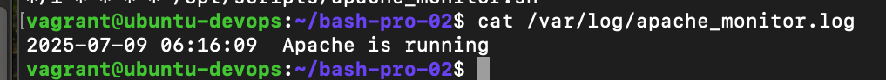
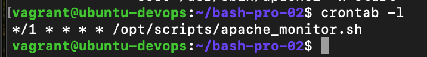

# FameTech DevOps Lab – OS-Aware Apache Monitoring & Auto-Heal Toolkit

> In this DevOps simulation lab, I developed a cross-platform Bash automation toolkit to monitor Apache service status and automatically recover from downtime.
> The toolkit is OS-aware (Ubuntu & CentOS), deployable on any VM, and designed to simulate real-world reliability engineering in hybrid environments.

---

## About This Project

This repository reflects my hands-on DevOps engineering experience while working on sprint-based automation at **FameTech**, a New York-based technology consultancy.

As a **DevOps Engineer** on the Monitoring & Reliability Team, I was tasked with designing a portable, script-only monitoring solution for QA and staging VMs without full observability stacks.

> This project experience is verifiable by FameTech upon request.

---

## Lab Metadata

| Field      | Detail                               |
| ---------- | ------------------------------------ |
| Lab ID     | BASH-PRO-002                         |
| Engineer   | Sheikh Ahmed (DevOps Engineer)       |
| Company    | FameTech NYC                         |
| Sprint     | Sprint 3 – Apache Monitoring Toolkit |
| Platform   | Ubuntu, CentOS, Vagrant, Bash, Cron  |
| Difficulty | Intermediate to Advanced             |
| Time       | \~60–90 minutes                      |

---

## Objectives

- Detect OS type (Ubuntu or CentOS) using reliable identifiers
- Install Apache conditionally using apt/yum
- Monitor Apache every minute using a Bash script and `cron`
- Automatically restart Apache if it’s down
- Log all events with timestamps to `/var/log/apache_monitor.log`

---

## Tools & Concepts Used

| Tool / Concept   | Purpose                                                  |
| ---------------- | -------------------------------------------------------- |
| `bash` scripting | Automate Apache monitoring and recovery                  |
| `yum`, `apt`     | Install Apache conditionally based on OS                 |
| `systemctl`      | Manage Apache service status                             |
| `cron`           | Schedule the monitor script to run every 1 minute        |
| OS detection     | Use `/etc/os-release` or `/etc/redhat-release` to detect |
| Logging          | Append timestamps and outcomes to a centralized log file |

---

## Predeployment Requirements

Before using these scripts, ensure:

- [ ] You have root or sudo privileges on the target VM
- [ ] The system has `cron`, `systemctl`, and Bash installed
- [ ] Apache is not already running or needs to be monitored
- [ ] Your scripts are saved under `/opt/scripts/` or an accessible path
- [ ] Scripts are executable: `chmod +x *.sh`

---

## Scenario – Ticket-Based Simulation

**Ticket**: `FAME-BASH-002`
**Reported By**: Sr. Site Reliability Engineer
**Assigned To**: Sheikh Ahmed
**Priority**: High
**Status**: Completed

The QA environment experienced intermittent Apache outages on both Ubuntu and CentOS VMs.
I was tasked to create a lightweight, cron-based monitoring script to detect service status and perform self-healing—without installing any third-party tools.

---

## Implementation

### Step 1 – OS-Aware Installer (`install_apache.sh`)

```bash
#!/bin/bash

if [ -f /etc/redhat-release ]; then
  echo "[INFO] CentOS detected"
  yum install -y httpd
  systemctl enable httpd
  systemctl start httpd
elif grep -qi ubuntu /etc/os-release; then
  echo "[INFO] Ubuntu detected"
  apt update && apt install -y apache2
  systemctl enable apache2
  systemctl start apache2
else
  echo "[ERROR] Unsupported OS"
  exit 1
fi
```

---

### Step 2 – Apache Monitor Script (`apache_monitor.sh`)

```bash
#!/bin/bash

LOG_FILE="/var/log/apache_monitor.log"
TIMESTAMP=$(date '+%F %T')

if pidof apache2 > /dev/null || pidof httpd > /dev/null; then
  echo "$TIMESTAMP Apache running" >> "$LOG_FILE"
else
  echo "$TIMESTAMP  Apache down. Restarting..." >> "$LOG_FILE"
  systemctl start apache2 2>/dev/null || systemctl start httpd 2>/dev/null
  echo "$TIMESTAMP 🔁 Restart attempt complete." >> "$LOG_FILE"
fi
```

---

### Step 3 – Setup Cron Job (`setup_cron.sh`)

```bash
#!/bin/bash

(crontab -l 2>/dev/null; echo "*/1 * * * * /opt/scripts/apache_monitor.sh") | crontab -
```

---

## Folder Structure

```
bash-pro-lab-002/
├── install_apache.sh           # ✅ One-time installer (OS-aware)
├── apache_monitor.sh           # ✅ Monitoring and auto-restart logic
├── setup_cron.sh               # ✅ Adds cronjob to crontab
├── screenshots/                # ✅ Visual verification
├── logs/                       # ✅ Apache monitor logs
└── README.md                   # ✅ This file
```

---

## Screenshots

Stored under `/screenshots/`:

- Apache install on CentOS
  
- Log contents
  
- Cron entry verification
  

---

## Validation Checklist

| Task                                          | Status |
| --------------------------------------------- | ------ |
| OS correctly detected                         | ✅     |
| Apache installed via yum or apt               | ✅     |
| Monitoring script detects Apache status       | ✅     |
| Script auto-starts Apache if it's down        | ✅     |
| Logs written to `/var/log/apache_monitor.log` | ✅     |
| Cron job created and running every minute     | ✅     |

---

## Interview Q\&A

> **Q**: How does the script detect which OS is running?  
> **A**: It checks for `/etc/redhat-release` for CentOS and parses `/etc/os-release` for Ubuntu.

> **Q**: Why use `pidof` instead of `systemctl is-active`?  
> **A**: `pidof` works across distros without assuming service names; it’s lightweight and cron-safe.

> **Q**: How does the auto-heal logic work?  
> **A**: If Apache is not running, the script attempts to start both `apache2` and `httpd` services.

> **Q**: What if I run this on unsupported OS?  
> **A**: The script will print an error and exit with code `1` to prevent unknown behavior.

---

## Real-World Use Cases

| Scenario                      | Relevance                                                 |
| ----------------------------- | --------------------------------------------------------- |
| Hybrid QA environments        | Supports Ubuntu and CentOS without extra configuration    |
| Headless infrastructure setup | Lightweight monitoring where no observability tools exist |
| Server reliability testing    | Simulate production behavior before full APM rollout      |
| DevOps onboarding assessments | Task new engineers with log-driven automation tasks       |

---

## Common Mistakes & Fixes

| Mistake                                | Fix                                                  |
| -------------------------------------- | ---------------------------------------------------- |
| Script doesn’t have execute permission | Use `chmod +x apache_monitor.sh`                     |
| Log file not created                   | Ensure `/var/log/` is writable or redirect elsewhere |
| Cron doesn’t execute                   | Double-check cron syntax and that cron is running    |
| Apache name mismatch                   | Use `pidof` instead of hardcoded service names       |

---

## Security & Production Notes

- Store logs in a centralized or rotated location (`logrotate` recommended)
- Secure script execution permissions (`chmod 700`)
- Use `/etc/cron.d/` or systemd timers for hardened scheduling in production
- For critical servers, trigger alerts (email, Slack) using `mail` or external hooks

---

## FameTech Story

As part of **Sprint 3**, I was responsible for building an Apache monitoring and recovery toolkit that would work on any FameTech staging VM without needing full-scale observability tooling.

The scripts were developed entirely in Bash and designed for portability, minimal dependencies, and automation via `cron`. This experience helped me simulate production-like monitoring on resource-constrained environments and apply real DevOps reliability practices.

---
